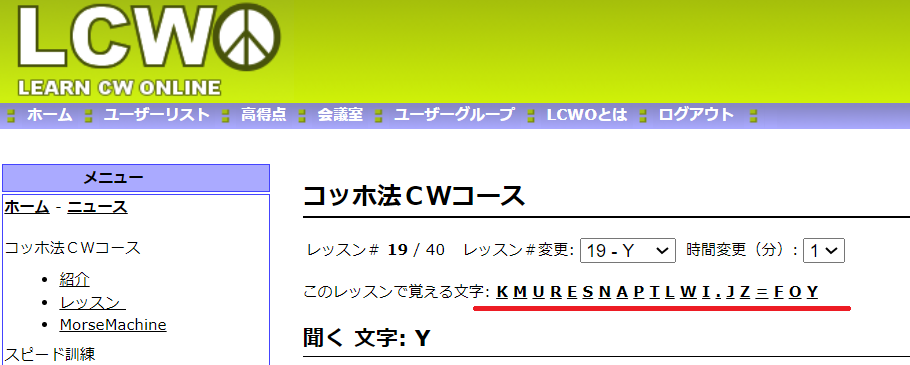

# モールス信号学習メモ

## 方針

- 耳で覚える。

## 避けるべき学習方法

- 合調法(語呂合わせ)
	- 一般的な20～25WPMのPARIS速度の場合、1短音の長さである60～48msの間に変換する必要がある。
		- 例えば、長音を`===`、短音を`@`、無音区間を`_`で表すと、AAは、`@_===___@_===____`のようになる。(文字区切りは1短音分、単語区切りは4短音分の無音)   
		この時、1文字目がAだと確定するのは`@_===__`のタイミングであり、  
		2文字目の開始までの猶予は1短音分しかない。  
		この為、1短音分の期間で変換する必要がある。 
		- PARIS速度の1短音の長さは 60秒/50短音/WPM で計算できる。25WPMなら0.048秒。20WPMなら0.06秒。
	- 語呂合わせなどの覚え方では、50ms程度の間に変換が難しいというのが一般的。
	- この為、語呂合わせで覚えてしまった場合、追加の訓練が必要で、この訓練は耳で覚えた場合より長い期間が必要になるといわれている。

## 取るべき学習方法

耳で、1文字分のモールスをそのまま一塊で直接覚えてしまう方法が良いといわれている。  
この場合、実用に耐える高速な変換が可能になる。

- 耳で覚える
	- モールス信号の長短の一区切りをそのままアルファベットに変換できるようになるのが目標。

- 音を言語化するのが最初の一歩。
	- [A1 CLUB](https://a1club.org/) が公開している [CW HANDBOOK](https://a1club.org/info/CWHANDBOOK2021.pdf) の22ページにある方法が、おそらく最も近い方法だと思われる。
		- https://a1club.org/sounds/MorseAlphabet.mp3
		- https://www.youtube.com/watch?v=uP6qwYalTpw
	- 上記の方法の次に忠実な方法は、上記HANDBOOKの23ページにあるようにLCWO.netを活用する方法だと思われる。

## tips

下記は個人的に有用に感じた方法。下記の記述が一般に正しいとは限らない。

- モールス信号自体の周波数は高め(750Hz～)の方が聞き取りやすく感じた。
- モールス信号の音をそのままパパーのように発声する方法が良さげだった(下記参照)。

## (独自研究)モールス信号の音をそのままパパーのように発声する方法

これはあくまで個人的な方法。鵜呑みにすべきではない。デメリットと思われる事項も書いておく。  
勿論既に誰かがやっている可能性はある。その場合そちらを真似したほうが良いと思われる。  

### 具体的な方法

1. 何か音を決める。
	- 音はパーでもピーでもポーでもターでもツーでもトーでも何でもよい。但し種類は**1種類**にすること。あくまでリズムを覚える。
		- 1種類というのは`._`をトンツーではなくパパーやツツーのように音を統一すべきという事。
		- これは語呂合わせ状態を避けるため。
			- (デメリット)1音に絞っても語呂合わせ状態になってしまう可能性がある。
				- 例えばボーにした場合、Fがボボボーボ、Dがボーボボになってしまい、FやDでボボボーボ・ボーボボが頭に浮かんでしまうような状態は語呂合わせ状態になってしまう。これは強烈。
		- モールス信号を聞いたとき、自分が最も近いと思う音が良いと思われる。ピーに聞こえるならピー、ポーに聞こえるならポーが良いと思われる。一度頭に残ると離れないと思われる。
			- (デメリット)つまりモールス信号の周波数で多少変わると思われる。この為、高音のモールス信号と低音のモールス信号で習熟度が変わる可能性がある。
				- ただ、音程が混在するモールス信号は難しいと思われるので、そもそも別で訓練が必要と思われる。

2. LCWOで覚える対象のモールス信号をそのまま発声する。
	- Kならピーピピー、Mならピーピー、Uならピピピー、Rならピピーピのようなイメージ。
	- 注意点
		- 必ず音から発声すること。LCWOにはないが、`._`のような記号を見ながら発声してはいけない。

3. LCWOのレッスンに挑む。

4. 間違えたところ付近を発声してみる。
	- 注意点
		- 必ず音から発声すること。LCWOにはないが、`._`のような記号を見ながら発声してはいけない。
		- `K`を間違えたら、ピーピピーというKの音を聞いて発生すること。
			- LCWO.netでは、レッスンページの下記の部分の文字をクリックすると音を聞くことができる。  
				  

### 考察

この方法は、音楽の分野でいう絶対音感の訓練方法に近いように思われる。

- モールス信号を耳で聞いてそのまま文字に変換するという状態は、楽器の音を聞いて音程(ドレミ)に直接変換できる絶対音感な状態に近いと思われる。
	- (個人の経験談)私は幼少期の訓練で絶対音感があったので、音がそのままドレミに聞こえる感覚がわかる。ピアノが話すようにドレミのように聞こえるという感覚。因みに長年離れたせいで絶対音感は失った。
	- (個人の経験談)絶対音感の訓練では、ドの音を弾き、それを聴き、同じ高さでドーと発声する、ような訓練する。これにより、ドの音を記憶しつつ、ドという単語に紐づけられ、音程が言語化される。
		- ドレミの歌ならドーレミードミードーミーのようなイメージ。歌詞として音程を歌うようなイメージ。
- 同様に、モールス信号を聴き、その音を発声することで、モールス信号を覚えつつ、言語化することができると思われる。
- しかし、これをそのまま適用するのは難しい。モールス信号は単音ではないため、ドの音をドーと発音するように訓練すると、Aの`._`を聞いて、それに合わせてAをええーのように発生するのは現実的ではない。
	- `._`を聞いたとき、Aではなくエイに変換される場合、その後の単語への変換が大変になる。よって、これは良くない方法。
		- 文字変換後の単語認識まで考えると文字に変換して一時的に貯めて、単語を認識する必要がある。
		- つまり、実用時は、`._` `.__.` `.__.` `._..` `.` を聴いて、`A`,`P`,`P`,`L`,`E`に変換し、appleと認識する必要がある。
		- Aではなくエイに変換されるようになってしまうと、`._`→エイ→Aのように1段階変換が増えることになる。これは不利。
- 絶対音感の訓練に最も近いのは上記で紹介したCW HANDBOOKの方法だと思われる。この方法は発声に関連付けにくい。
- 対して、この方法はモールス信号のリズムを言語化している。言語化の方法としては次善の方法と思われる。

