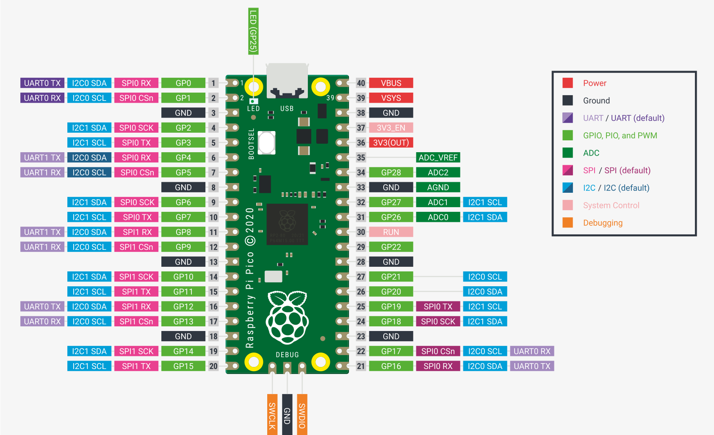
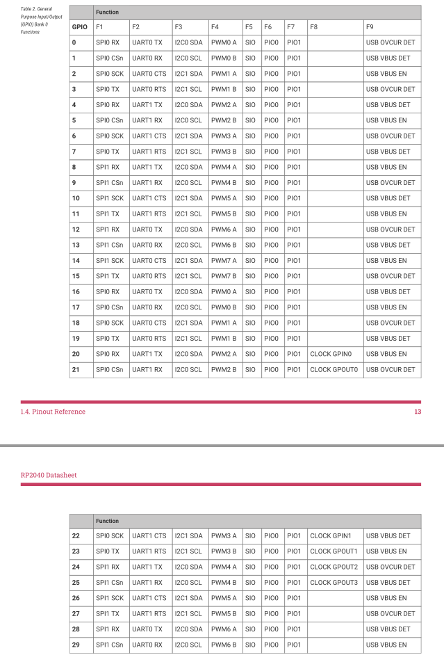

# raspberry pi picoで作る複式電鍵用エレキー

複式電鍵で練習したかった。  
電鍵もエレキーも高いので自作する。  
実用に耐えるかどうかは...  

## ピンアサイン

バージョンによって変わります。

GPIO | 説明
----|----
  0 | 出力ピン
  1 | モニター用サウンド出力ピン
  2 | 単式用入力
  3 | 複式用短音入力
  4 | 複式用長音入力
  5 | スピードアップ
  6 | スピードダウン
  7 | 周波数アップ
  8 | 周波数ダウン
  9 | デバウンスアップ
 10 | デバウンスダウン
 11 | 長短パドル反転

> 

## 仕様

### 信号の速さ

初期値を25wpmとして、調整可能範囲を5wpmから35wpmまでとしている。  

### モニター用ビープ音

とりあえず、800を基準に、400から1200まで50Hz刻みで設定できるようにしている。  

一応PWM変調で正弦波を出力している。
周波数はそこそこずれる。800の時実測850くらいだった。
この辺はPWM変調の使い方が悪そう。
ただ、開始終了部分に窓関数をかけていないので音のなり始めと終わりがひどい。
なんでもいいので窓関数をかける必要がある。

### チャタリング防止

デバウンス初期値20msとしている。
0msから200msまで10ms刻みで設定できる。

### 長短パドル反転

反転できるようにしている。

## 検討事項

- 同時押しはどうするか。
    - 現状無視。
- 長押しはどうするか。
    - 現状無視。

## 展望

### 正弦波出力

一応実装した。

> 音が矩形波で聞き難い。  
> ADCもあるが、PWM変調な感じにすればおそらくできそう。  
> https://tinygo.org/docs/tutorials/pwm/  

> PWMにどのGPIOを使うかでPWMの時に指定する値が変わる。  
> 
> GPIO1でPWMする場合F4列に`PWM0 B`とあるのでPWM0を指定すればよい。

### 設定保存

https://pkg.go.dev/tinygo.org/x/drivers/flash#W25Q16FW

この辺を使えばたぶんflashに保存できると思うけどまだ何もやっていない。

### ロータリーエンコーダ対応

設定値変更はロータリーエンコーダか単純な可変抵抗でやりたい。ボタンポチポチは面倒。  
ただし設定値保存ができる場合、そんなにはいじらないので十分ではある。  

