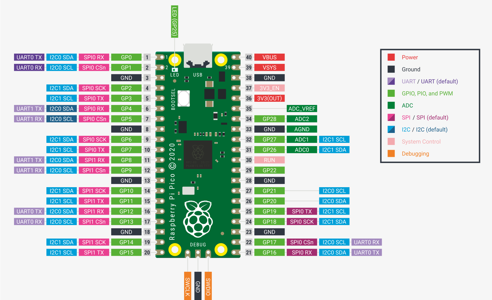
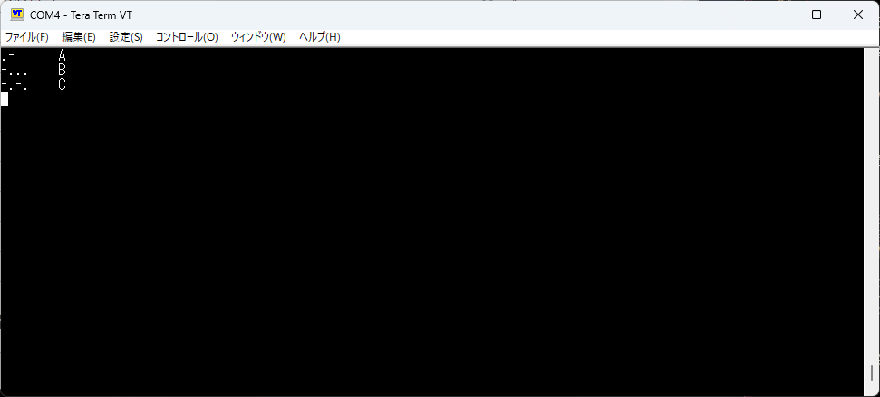
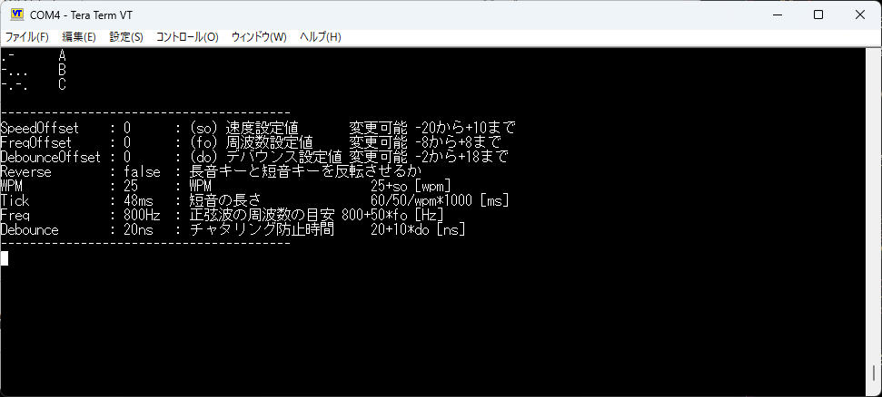

# raspberry pi picoで作る複式電鍵用エレキー

複式電鍵で練習したかった。  
電鍵もエレキーも高いので自作する。  
実用に耐えるかどうかは...  

## ピンアサイン

バージョンによって変わります。

GPIO | 説明
----|----
  0 | 出力ピン
  1 | モニター用サウンド出力ピン
  2 | 単式電鍵用ピン
  3 | 複式電鍵用短音ピン
  4 | 複式電鍵用長音ピン
  5 | 設定リセットピン
  6 | スピードアップピン
  7 | スピードダウンピン
  8 | 周波数アップピン
  9 | 周波数ダウンピン
 10 | デバウンスアップピン
 11 | デバウンスダウンピン
 12 | 長短反転ピン

> 

## 仕様

### 信号の速さ

初期値を25wpmとして、調整可能範囲を5wpmから35wpmまでとしている。  

### モニター用ビープ音

とりあえず、800を基準に、400から1200まで50Hz刻みで設定できるようにしている。  

一応PWM変調で正弦波を出力している。
周波数はそこそこずれる。800の時実測850くらいだった。
この辺はPWM変調の使い方が悪そう。
ただ、開始終了部分に窓関数をかけていないので音のなり始めと終わりがひどい。
なんでもいいので窓関数をかける必要がある。

### チャタリング防止

デバウンス初期値20msとしている。
0msから200msまで10ms刻みで設定できる。

### 長短パドル反転

反転できるようにしている。

### 長押し

長押ししているとリピートする。

### 正弦波出力

モニター用に正弦波を出している。
と言っても、PWM変調を利用した出力でしかないので、外部にLPFを必要とする。

### 設定保存

設定値保存機能を実装した。  
flashにあまり頻繁に書き込まないように、設定値変更後最初の打鍵時に保存するようにしている。

## おまけ機能

Tera Term等でシリアル覗くと情報が見える。

1. 打鍵した短音と長音を解析して文字に変換して表示する。

2. 5秒以上何も操作しないと現在の設定を出力する。

## 検討事項

### 同時押しはどうするか。
	- 現状無視。
	- スクイーズ操作を実装する？

### ロータリーエンコーダ対応

設定値変更はロータリーエンコーダか単純な可変抵抗でやりたい。ボタンポチポチは面倒。  
ただし設定値保存ができる場合、そんなにはいじらないので十分ではある。  

